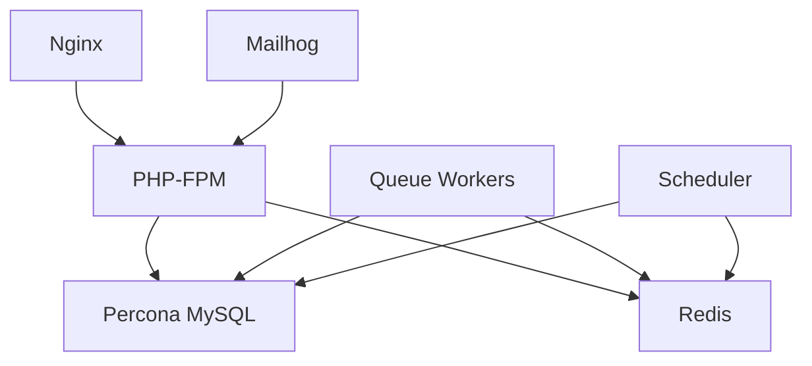

# Laravel Docker Deployment Guide

This document provides comprehensive instructions for deploying the Laravel 11 + Filament 3 application using Docker.

## 🚀 Quick Start

### Prerequisites
- Docker 20.x+ and Docker Compose
- Git (for cloning the repository)
- 4GB+ RAM available for Docker
- 10GB+ disk space

### Development Deployment

**Windows:**
```cmd
.\deploy.bat development
```

**Linux/macOS:**
```bash
chmod +x deploy.sh
./deploy.sh development
```

### Production Deployment

**Windows:**
```cmd
.\deploy.bat production
```

**Linux/macOS:**
```bash
./deploy.sh production
```

## 📋 Architecture Overview

The Docker setup includes the following services:



### Services

1. **Nginx (1.25-alpine)**: Web server with FastCGI caching
2. **PHP-FPM (8.3-alpine)**: Application server with OPcache optimization
3. **Percona MySQL (8.0)**: High-performance MySQL database
4. **Redis (7.2-alpine)**: Cache and session storage
5. **Queue Workers**: Laravel job processing
6. **Scheduler**: Laravel task scheduling
7. **Mailhog**: Email testing (development only)

## 🔧 Configuration

### Environment Files

- **`.env`**: Development configuration
- **`.env.production`**: Production configuration

### Key Configuration Files

| File | Purpose |
|------|---------|
| `docker/php/Dockerfile` | Multi-stage PHP build |
| `docker/php/php.ini` | PHP configuration |
| `docker/php/opcache.ini` | OPcache optimization |
| `docker/php/php-fpm-pool.conf` | PHP-FPM pool settings |
| `docker/nginx/default.conf` | Nginx virtual host |
| `docker/mysql/my.cnf` | MySQL optimization |
| `docker/redis/redis.conf` | Redis configuration |

## 🛠️ Manual Commands

### Container Management

```bash
# Start services
docker-compose up -d

# Stop services
docker-compose down

# View logs
docker-compose logs -f [service-name]

# Restart specific service
docker-compose restart [service-name]

# Rebuild containers
docker-compose build --no-cache

# Remove all containers and volumes
docker-compose down -v --remove-orphans
```

### Laravel Commands

```bash
# Run Artisan commands
docker-compose exec php php artisan [command]

# Access container shell
docker-compose exec php bash

# Run migrations
docker-compose exec php php artisan migrate

# Clear caches
docker-compose exec php php artisan config:clear
docker-compose exec php php artisan cache:clear
docker-compose exec php php artisan view:clear

# Generate app key
docker-compose exec php php artisan key:generate
```

### Database Management

```bash
# Access MySQL shell
docker-compose exec mysql mysql -u root -p

# Create database backup
docker-compose exec mysql mysqldump -u root -p[password] [database] > backup.sql

# Restore database
docker-compose exec -T mysql mysql -u root -p[password] [database] < backup.sql
```

## 🔒 Security Considerations

### Production Security Checklist

- [ ] Change all default passwords in `.env.production`
- [ ] Use strong, unique passwords for database
- [ ] Configure SSL certificates (place in `docker/nginx/ssl/`)
- [ ] Set up firewall rules
- [ ] Enable Docker BuildKit for improved security
- [ ] Regularly update base images
- [ ] Monitor security logs

### SSL Configuration

For production, add SSL certificates:

1. Place certificates in `docker/nginx/ssl/`
2. Update Nginx configuration for HTTPS
3. Update `.env.production` with HTTPS URLs

## 📊 Performance Tuning

### Resource Allocation

**Development:**
- MySQL: 512MB RAM
- Redis: 256MB RAM
- PHP: 512MB per process

**Production:**
- MySQL: 2GB RAM
- Redis: 512MB RAM
- PHP: 256MB per process
- Scale PHP-FPM workers based on load

### Optimization Tips

1. **Database Indexing**: Monitor slow query log
2. **OPcache**: Enabled with JIT compilation
3. **Redis**: Used for sessions and cache
4. **Nginx**: FastCGI caching enabled
5. **Asset Optimization**: Vite builds optimized assets

## 🐛 Troubleshooting

### Common Issues

#### Container Startup Failures

```bash
# Check container status
docker-compose ps

# View detailed logs
docker-compose logs [service-name]

# Check resource usage
docker stats
```

#### Database Connection Issues

```bash
# Verify MySQL is running
docker-compose exec mysql mysql -u root -p -e "SELECT 1"

# Check network connectivity
docker-compose exec php ping mysql
```

#### Permission Issues

```bash
# Fix Laravel storage permissions
docker-compose exec php chown -R www-data:www-data /var/www/html/storage
docker-compose exec php chmod -R 755 /var/www/html/storage
```

#### Cache Issues

```bash
# Clear all Laravel caches
docker-compose exec php php artisan config:clear
docker-compose exec php php artisan cache:clear
docker-compose exec php php artisan view:clear
docker-compose exec php php artisan route:clear

# Clear OPcache
docker-compose restart php
```

### Performance Issues

#### Slow Application Response

1. Check MySQL slow query log: `docker-compose logs mysql | grep slow`
2. Monitor PHP-FPM status: `docker-compose exec nginx curl php:9000/status`
3. Check Redis memory usage: `docker-compose exec redis redis-cli info memory`

#### High Memory Usage

1. Adjust PHP-FPM pool settings in `docker/php/php-fpm-pool.conf`
2. Tune MySQL buffer sizes in `docker/mysql/my.cnf`
3. Configure Redis maxmemory policy

## 📈 Monitoring

### Health Checks

All services include health checks:

```bash
# Check service health
docker-compose ps

# Manual health check
curl http://localhost/nginx-health
```

### Log Monitoring

```bash
# Follow all logs
docker-compose logs -f

# PHP application logs
docker-compose logs -f php

# Nginx access logs
docker-compose logs -f nginx

# MySQL slow query logs
docker-compose exec mysql tail -f /var/log/mysql/slow.log
```

## 🔄 Backup and Recovery

### Database Backup

```bash
# Create backup
docker-compose exec mysql mysqldump -u root -p ebbm_new > backup_$(date +%Y%m%d_%H%M%S).sql

# Automated backup script
#!/bin/bash
BACKUP_DIR="/backups"
DATE=$(date +%Y%m%d_%H%M%S)
docker-compose exec mysql mysqldump -u root -p${DB_PASSWORD} ${DB_DATABASE} > ${BACKUP_DIR}/backup_${DATE}.sql
gzip ${BACKUP_DIR}/backup_${DATE}.sql
```

### Volume Backup

```bash
# Backup all volumes
docker run --rm -v ebbm-new_mysql_data:/data -v $(pwd):/backup alpine tar czf /backup/mysql_backup.tar.gz -C /data .
```

## 🚀 Deployment Pipeline

### CI/CD Integration

Example GitHub Actions workflow:

```yaml
name: Deploy Laravel App

on:
  push:
    branches: [main]

jobs:
  deploy:
    runs-on: ubuntu-latest
    steps:
      - uses: actions/checkout@v2
      
      - name: Deploy to production
        run: |
          ./deploy.sh production
```

### Blue-Green Deployment

For zero-downtime deployments:

1. Deploy to staging environment
2. Run tests and health checks
3. Switch traffic to new version
4. Keep old version as rollback option

## 📞 Support

For issues or questions:

1. Check the troubleshooting section
2. Review Docker and Laravel logs
3. Consult Laravel and Docker documentation
4. Open an issue in the project repository

---

**Note**: This deployment guide assumes familiarity with Docker, Laravel, and basic system administration. Always test in a staging environment before production deployment.